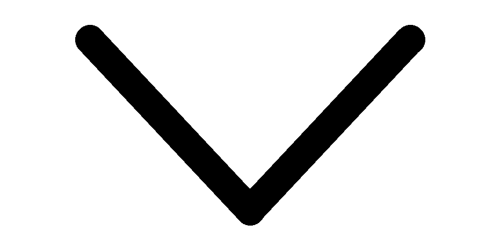

# Vestaboard-x for Home Assistant

[](https://github.com/bdeakin/ha-vestaboard/releases)
[](https://github.com/hacs/integration)

Home Assistant integration for Vestaboard messaging displays (**Vestaboard-x**).

This is a personal fork of [natekspencer/ha-vestaboard](https://github.com/natekspencer/ha-vestaboard). It exists to make generating VBML more intuitive—especially when including live Home Assistant sensors—by letting you pick entities/templates as props and compose board regions with per-component alignment and sizing, without hand-writing escaped JSON.

## Local API Access Required

To use this integration, you **must first request access to Vestaboard's Local API**. This is required to enable local communication with your Vestaboard device.

### How to Request Access

1. Visit [https://www.vestaboard.com/local-api](https://www.vestaboard.com/local-api).
2. Fill out the request form to apply for a Local API enablement token.
3. Once approved, you will receive a token that you'll need to configure this integration.

**Note:** The integration will not function without this token. Be sure to complete this step before proceeding with setup.

## Installation

### HACS (Recommended)

1. In HACS → Integrations → ⋮ → **Custom repositories**, add `https://github.com/bdeakin/ha-vestaboard` as an **Integration**.
2. Search for `Vestaboard-x` and download this fork (HACS installs from the repository; no GitHub Release zip is required).
3. Restart Home Assistant.

You can also use the My Home Assistant badge once the repo is public:

[](https://my.home-assistant.io/redirect/hacs_repository/?owner=bdeakin&repository=ha-vestaboard&category=integration)

### Manual

1. Download or clone this repository
2. Copy the `custom_components/vestaboard` folder to your Home Assistant `custom_components` directory
3. Restart Home Assistant

> Manual installation will not provide automatic update notifications. HACS installation is recommended unless you have a specific need.

## Setup

Once installed, you can set up the integration by clicking on the following badge:

[](https://my.home-assistant.io/redirect/config_flow_start/?domain=vestaboard)

Alternatively:

1. Go to [Settings > Devices & services](https://my.home-assistant.io/redirect/integrations/)
2. In the bottom-right corner, select **Add integration**
3. Type `Vestaboard-x` and select the **Vestaboard-x** integration
4. Follow the instructions to add the integration to your Home Assistant

## Options

After this integration is set up, you can configure the color of your Vestaboard to adjust the image that is generated.

|          |                                       Black                                       |                                       White                                       |
| -------- | :-------------------------------------------------------------------------------: | :-------------------------------------------------------------------------------: |
| Flagship |  |  |
| Note     |           |           |

## Vestaboard-x panel (VBML editor)

After installing and restarting, open **Vestaboard-x** in the Home Assistant sidebar.

- Save **multiple named templates** (one per game). All eight Stern 2026 leaderboard games are seeded with their sensors — edit, copy YAML, or save your own variants.
- Add **props** (entity ID and/or Jinja template)
- Open the **VBML editor** modal for syntax-colored JSON
- Drag (or click) props into the markup to insert `{{prop_name}}`
- Live validation: editor border turns green when VBML is valid, red when invalid (JSON + schema + optional device parse)
- **Copy for automation** places a ready-to-paste `vestaboard.message` YAML block on the clipboard (`props` + `vbml`). At send time, props are resolved and merged into the VBML payload so sensor values stay live.
- Send the message to a selected board from the panel

## Actions

### `vestaboard.message` - Send a message to one or more Vestaboards

[](https://my.home-assistant.io/redirect/developer_call_service/?service=vestaboard.message)

#### Fields

| Field                | Name                       | Required | Description |
| -------------------- | -------------------------- | -------- | ----------- |
| `device_id`          | Device                     | Yes      | The Vestaboard device(s) to send the message to. Supports multiple devices. |
| `message`            | Message                    | No       | Plain text message. Ignored when `components` or `vbml` are set. |
| `justify` / `align`  | Justify / Align            | No       | Horizontal / vertical alignment for a simple `message`. Default: `center`. |
| `props`              | Props                      | No       | Dynamic values from entities or Jinja templates. Used with `components`. |
| `components`         | Components                 | No       | Structured VBML regions (template + formatting). Preferred over raw `vbml`. |
| `vbml`               | Vestaboard Markup Language | No       | Advanced raw VBML object. Overrides `message` and `components`. |
| `strategy`           | Transition Strategy        | No       | Animation style when a new message is sent. See [Transition Strategy](#transition-strategy). |
| `step_size`          | Step Size                  | No       | Columns/rows/bits to animate together. Range: 1–132. |
| `step_interval_ms`   | Step Interval              | No       | Delay between animation steps in ms. Range: 1–3000. |
| `duration`           | Duration                   | No       | Temporary display duration in seconds (10–43200), then restore persistent message. |
| `bypass_quiet_hours` | Bypass Quiet Hours         | No       | If `true`, ignore quiet hours and send immediately. |

Message source priority: **`vbml` > `components` (+ optional `props`) > `message`**.

#### Structured components (recommended)

Use **Props** to pull live Home Assistant values, then reference them in component templates with VBML `{{prop_name}}` syntax. Put Home Assistant Jinja in prop `template` fields—not in component templates—so the two `{{ }}` languages do not collide.

Each component supports:

- `template` — text with `{{prop}}` placeholders
- `justify` — `left`, `right`, `center`, `justified`
- `align` — `top`, `bottom`, `center`, `justified`
- `height` / `width` — region size in rows/columns
- `x` / `y` — optional absolute position (both required together)

**Props** each have a `name`, plus either:

- `entity_id` (optional `attribute`), or
- `template` (Home Assistant Jinja; wins when both are set)

##### Example — single game (title / player / score)

```yaml
action: vestaboard.message
data:
  device_id: your_device_id
  props:
    - name: player
      entity_id: sensor.2026_leaderboard_elvira_s_house_of_horrors_top_player
    - name: score
      entity_id: sensor.2026_leaderboard_elvira_s_house_of_horrors_top_score
      template: >-
        {{ '{:,.0f}K'.format((states('sensor.2026_leaderboard_elvira_s_house_of_horrors_top_score')
        | float(0) / 1000)) }}
  components:
    # Corner accents: {70}=black, {63}=red (other games use different accent colors)
    - template: "{70}"
      height: 1
      width: 1
      x: 0
      y: 0
    - template: "{63}"
      height: 1
      width: 1
      x: 21
      y: 0
    - template: "ELVIRA'S HOUSE\nOF HORRORS"
      justify: center
      height: 2
      width: 22
      x: 0
      y: 1
    - template: "{{player}}"
      justify: center
      height: 1
      width: 22
      x: 0
      y: 3
    - template: "TOP SCORE {{score}}"
      justify: center
      height: 1
      width: 20
      x: 1
      y: 5
    - template: "{63}"
      height: 1
      width: 1
      x: 0
      y: 5
    - template: "{70}"
      height: 1
      width: 1
      x: 21
      y: 5
```

The panel ships saved templates for every Stern 2026 leaderboard game (D&D, Elvira, Godzilla, Jaws, John Wick, Jurassic Park, Pokemon, X-Men), each wired to its `top_player` / `top_score` sensors.

#### Transition Strategy

`strategy` accepts one of the following literal values. The "Display Name" column shows how each option is labeled in the UI, but is _not_ an acceptable value you can pass; only the `strategy` column values are valid.

| `strategy`\* (accepted value) | Display Name (UI only)                  |
| ----------------------------- | --------------------------------------- |
| `classic`                     | Classic (all-at-once)                   |
| `column`                      | Wave (left-to-right)                    |
| `reverse-column`              | Drift (right-to-left)                   |
| `edges-to-center`             | Curtain (outside-in, meeting in center) |
| `row`                         | Row (top-to-bottom)                     |
| `diagonal`                    | Diagonal (top-left to bottom-right)     |
| `random`\*\*                  | Random bits                             |

\* Applies to all strategies except `classic`: every bit animates on each transition, regardless of whether the character is changing.

\*\* The `random` strategy animates individual bits rather than full rows/columns, with a delay of several seconds (up to 10) between each step. A transition must fully complete before a new message can be displayed, so a small `step_size` means many more steps are needed to animate the full board. On a Flagship Vestaboard (132 bits), this can add up to several minutes before the board accepts a new message.

---

#### More examples

**Send a simple text message:**

```yaml
action: vestaboard.message
data:
  device_id: your_device_id
  message: "Hello, world!"
  justify: center
  align: center
```

**Send a temporary message with a transition animation:**

```yaml
action: vestaboard.message
data:
  device_id: your_device_id
  message: "Dinner is ready!"
  strategy: column
  step_interval_ms: 500
  duration: 120
```

**Advanced raw VBML** (escape hatch; prefer `components` / `props` above):

```yaml
action: vestaboard.message
data:
  device_id: your_device_id
  vbml:
    props:
      hours: "07"
      minutes: "35"
    components:
      - style:
          justify: center
          align: center
        template: "{{hours}}:{{minutes}}"
```

**Send to multiple devices, bypassing quiet hours:**

```yaml
action: vestaboard.message
data:
  device_id:
    - device_id_1
    - device_id_2
  message: "Good morning!"
  bypass_quiet_hours: true
```

---

#### Notes

- Provide one of `message`, `components`, or `vbml`.
- `step_size` and `step_interval_ms` only apply when a `strategy` is specified.
- `duration` is useful for transient alerts - the board will restore its last persistent message automatically after the duration expires.
